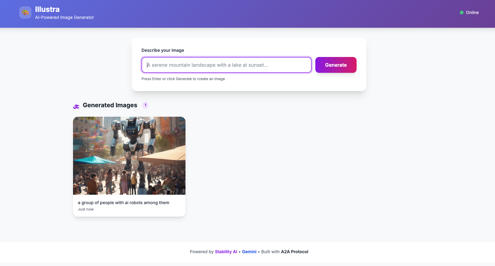

# Illustra

AI image generation monorepo with an A2A-compatible agent and a web UI.

```
User → Illustra UI (Express + Tailwind)
         ↓ /api/generate
       Illustra Agent (LangChain + Gemini)
         ↓ tool call (prefix routing)
       Stability AI (default) or OpenAI GPT Image 2.0
         ↓ upload
       GCS Bucket → Public URL
```

## Screenshot



## Packages

| Package                      | Description                                                                  | Port |
| ---------------------------- | ---------------------------------------------------------------------------- | ---- |
| [`@illustra/agent`](./agent) | LangChain + Gemini agent with Stability AI image generation via A2A protocol | 8080 |
| [`@illustra/ui`](./ui)       | Express + Tailwind web interface that proxies requests to the agent          | 8080 |

## Prerequisites

- [Bun](https://bun.sh) runtime
- Google Cloud project with GCS bucket
- Stability AI API key
- Google Gemini API key

## Quick Start

1. **Install dependencies**:

   ```bash
   bun install
   ```

2. **Set up environment variables**:

   Agent (`agent/.env`):

   ```env
   GOOGLE_API_KEY=your_gemini_api_key
   STABILITY_KEY=your_stability_api_key
   GCS_BUCKET_NAME=illustra
   PORT=8080
   ```

   UI (`ui/.env`):

   ```env
   PORT=3000
   AGENT_URL=http://localhost:8080
   ```

3. **Run both services**:

   ```bash
   bun dev
   ```

   Or run individually:

   ```bash
   bun dev:agent   # starts agent on :8080
   make run-ui     # starts UI on :3000 (local dev override)
   ```

## Development

```bash
bun dev              # run both services concurrently
bun dev:agent        # run agent only
bun dev:ui           # run UI only
bun check            # lint + typecheck all packages
bun check:agent      # lint + typecheck agent
bun check:ui         # lint + typecheck UI
```

## Agent API

- `GET /health` - Health check
- `GET /.well-known/agent-card.json` - A2A Agent Card discovery
- `POST /a2a/invoke` - A2A JSON-RPC endpoint

### Provider Prefix Syntax

The agent supports two image generation providers. Use message prefixes to switch between them:

| Prefix | Provider | Default Quality | Example |
|--------|----------|----------------|---------|
| (none) | Stability AI (default) | - | `A cute cat` |
| `[openai]` | OpenAI GPT Image 2.0 | `low` | `[openai] A cute cat` |
| `[stability]` | Stability AI | - | `[stability] A cute cat` |

### Quality Prefix (OpenAI only)

Add a quality prefix to control OpenAI image quality:

| Prefix | Quality | Example |
|--------|---------|---------|
| `[low]` | Low ($0.006 / 1024×1024) | `[openai][low] A cute cat` |
| `[medium]` | Medium ($0.053 / 1024×1024) | `[openai][medium] A cute cat` |
| `[high]` | High ($0.211 / 1024×1024) | `[openai][high] A cute cat` |
| `[auto]` | Auto (model decides) | `[openai][auto] A cute cat` |

Prefix order doesn't matter: `[high][openai]` works the same as `[openai][high]`.

### Example: Generate Image (Stability AI - Default)

```bash
curl -X POST http://localhost:8080/a2a/invoke \
  -H "Content-Type: application/json" \
  -d '{
    "jsonrpc": "2.0",
    "id": 1,
    "method": "message/send",
    "params": {
      "message": {
        "role": "user",
        "parts": [{"type": "text", "text": "A cute cat"}]
      }
    }
  }'
```

### Example: Generate Image (OpenAI, High Quality)

```bash
curl -X POST http://localhost:8080/a2a/invoke \
  -H "Content-Type: application/json" \
  -d '{
    "jsonrpc": "2.0",
    "id": 2,
    "method": "message/send",
    "params": {
      "message": {
        "role": "user",
        "parts": [{"type": "text", "text": "[openai][high] A cute cat"}]
      }
    }
  }'
```

Response (A2UI format):

```json
{
  "jsonrpc": "2.0",
  "id": 1,
  "result": {
    "role": "assistant",
    "parts": [
      {
        "kind": "data",
        "data": {
          "type": "Image",
          "props": {
            "url": "https://storage.googleapis.com/illustra/images/1234567890.png",
            "alt": "A cute cat"
          }
        }
      }
    ],
    "messageId": "uuid"
  }
}
```

## Environment Variables

### Agent (`@illustra/agent`)

| Variable          | Required | Description                  |
| ----------------- | -------- | ---------------------------- |
| `GOOGLE_API_KEY`  | Yes      | Google Gemini API key        |
| `STABILITY_KEY`   | Yes      | Stability AI API key         |
| `OPENAI_API_KEY`   | No       | OpenAI API key (for GPT Image 2.0) |
| `GCS_BUCKET_NAME` | Yes      | GCS bucket for image storage |
| `PORT`            | No       | Server port (default: 8080)  |

### UI (`@illustra/ui`)

| Variable    | Required         | Description                                     |
| ----------- | ---------------- | ----------------------------------------------- |
| `PORT`      | No               | Server port (default: 8080)                     |
| `AGENT_URL` | Yes (deployment) | Agent endpoint (default: http://localhost:8080) |

## Deployment

Each service uses its own `env.yaml` file for Cloud Run environment variables. Edit these files before deploying with your actual values.

### Agent

Edit `agent/env.yaml` with your API keys:

```yaml
GOOGLE_API_KEY: your_gemini_api_key
STABILITY_KEY: your_stability_api_key
GCS_BUCKET_NAME: illustra
```

Then deploy:

```bash
make deploy
```

Or manually:

```bash
cd agent && gcloud run deploy illustra-agent \
  --source . \
  --region asia-south1 \
  --port 8080 \
  --env-vars-file env.yaml \
  --allow-unauthenticated
```

### UI

Edit `ui/env.yaml` with your agent's Cloud Run URL:

```yaml
AGENT_URL: https://illustra-agent-xxxxx.a.run.app
```

Find your agent URL via:

```bash
gcloud run services describe illustra-agent --region asia-south1 --format="value(status.url)"
```

Then deploy:

```bash
make deploy-ui
```

Or manually:

```bash
cd ui && gcloud run deploy illustra-ui \
  --source . \
  --region asia-south1 \
  --env-vars-file env.yaml \
  --allow-unauthenticated
```

## Project Structure

```
illustra/
├── agent/
│   ├── src/
│   │   ├── main.ts                     # Entry point
│   │   ├── a2a/
│   │   │   └── server.ts              # A2A server with CORS
│   │   ├── agent/
│   │   │   ├── illustra_agent.ts      # LangChain agent
│   │   │   └── tools/
│   │   │       └── stability_tool.ts  # Stability AI tool
│   │   ├── config/
│   │   │   └── env.ts                 # Environment variables
│   │   └── utils/
│   │       ├── a2ui.ts                # A2UI helpers
│   │       └── storage.ts             # GCS upload utility
│   ├── env.yaml                       # Cloud Run env vars (gitignored)
│   ├── package.json
│   ├── tsconfig.json
│   ├── Dockerfile
│   └── .env.example
├── ui/
│   ├── src/
│   │   ├── index.ts                   # Express server entry
│   │   └── a2a/
│   │       └── client.ts              # A2A proxy routes
│   ├── public/
│   │   └── index.html                 # Tailwind CSS SPA
│   ├── package.json
│   ├── tsconfig.json
│   ├── Dockerfile
│   ├── env.yaml                       # Cloud Run env vars (gitignored)
│   └── .env.example
├── scripts/
│   ├── test.sh                        # Health check + agent card test
│   └── test-a2a.sh                    # A2A invoke test
├── package.json                       # Root workspace config
├── biome.json                         # Linting/formatting
├── commitlint.config.js               # Commit message conventions
├── Makefile                           # Build/deploy targets
└── .gitignore
```

## License

MIT

## Author

Mayank (@mnkrana) — [github.com/mnkrana](https://github.com/mnkrana)
